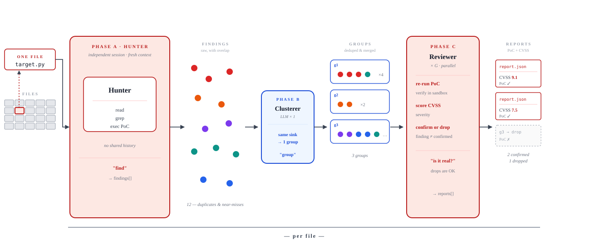
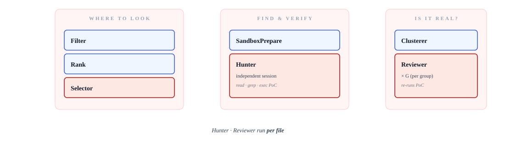
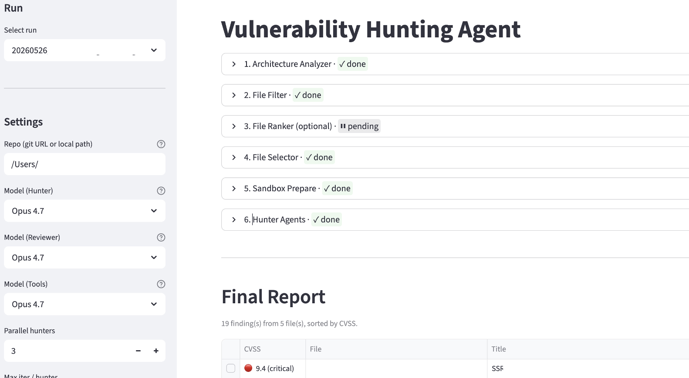

# Vulnerability Hunting Agent

> An LLM agent that **reads code, forms hypotheses, writes a PoC, and executes it in a Docker sandbox** — then ships only the bugs it could actually trigger.

[**한국어 README**](README.ko.md)  ·  Apache-2.0  ·  Python 3.11+

---

A reproduction of the **Anthropic "Project Mythos" scaffold** (file-level
parallel hunters + a reviewer stage) on a publicly accessible frontier
model — no preview model required.

---

## Per-file independent hunts

<p align="center">
  
</p>

For every top-ranked file the scanner runs an independent hunter
session — fresh context, no shared history.

A separate **Reproducer** runs each PoC twice in clean containers. The
evidence-only **Reviewer** can confirm, reject, or request a declarative
reproduction variant, but cannot execute commands itself. Per-file bounding
gives deterministic coverage and clean parallelism.

These three pieces (Hunter · Clusterer · Reviewer) **adapt the Mythos
building blocks (Ranker · Hunters · Reviewer)** for public-model access.

---

## Pipeline

<p align="center">
  
</p>

```
Filter → Rank → Selector → Sandbox Prepare → Hunt (Hunter → Cluster → Review) → Report
```

1. **Filter** — drop tests, vendored, generated code (no LLM).
2. **Rank** — score every source file 1–5 for security relevance.
3. **Selector** — pick which files Hunters will run on.
4. **Sandbox Prepare** — build a per-repo Docker image (deterministic
   install/build per environment: pip / mvn / npm / CMake / Make / Meson /
   Autotools). Or use a custom image you've built.
5. **Hunt** — *one independent session per file*. Reads, greps, writes
   a PoC into `/workspace`, executes it in a network-isolated Docker
   container. `network: none`, `/code` read-only, `/workspace` tmpfs. Native
   PoCs are compiled into the isolated executable tmpfs at `/workspace/exec`.
6. **Cluster** — group near-duplicate findings within a file.
7. **Review** — evidence citations + CVSS/CWE; high/critical findings require
   two distinct model/prompt configurations.
8. **Report** — consensus-gated canonical JSON + Markdown + SARIF 2.1.0.

Each Hunter is a fresh session. They don't share history; the diversity
of independent runs is the point.

---

## Quick start

> **Requirements:** Python 3.11+, Docker, and either an OpenAI Platform API
> key or a Codex CLI login backed by a ChatGPT subscription.

```bash
# 1. install
git clone https://github.com/sh3rlock93/vulnhunt-agent-next.git
cd vulnhunt-agent-next
pip install -e .

# 2. config
cp settings.example.toml settings.toml

# 3a. preferred path: OpenAI Responses API (Platform billing)
export OPENAI_API_KEY="..."

# 3b. fallback when OPENAI_API_KEY is absent: ChatGPT subscription
codex login
codex login status

# 4. run the UI
streamlit run src/vulnhunt_agent/app.py
```

In the sidebar: pick a repo (git URL or local path), pick an
**Environment** (e.g. `python:3.12`, `java:21`), click **Save**,
then run each step from top to bottom.

For a native C repository, select `c:gcc-13`. Auto prepare builds CMake, Make,
Meson, or Autotools projects with ASan/UBSan. C/H files use tree-sitter-c;
Flex/Bison `.l`/`.y` sources are also retained for ranking and cross-file tracing.
The pinned libcue benchmark and its blind-test procedure are documented in
[`docs/milestones/m3-c-native-analysis.md`](docs/milestones/m3-c-native-analysis.md).

The evidence-review and strict-export contract is documented in
[`docs/milestones/m4-evidence-review-reporting.md`](docs/milestones/m4-evidence-review-reporting.md).
For a populated V2 metadata store, export all consensus-verified findings with:

```bash
vulnhunt --db .vulnhunt/state.db export RUN_ID \
  --artifacts .vulnhunt/artifacts \
  --output output
```

The default `openai_auto` provider checks the configured key environment
variable first. It uses the Responses API when the key is non-empty; otherwise
it invokes the logged-in Codex CLI. Runtime API failures do not silently switch
billing paths. The CLI fallback has higher per-call overhead and is intended for
local use; the Responses API remains the preferred automation path. Bedrock
remains available as an explicit provider.

<p align="center">
  
</p>

When a run has V2 metadata, the UI also shows its finding states, evidence
counts, Reviewer counts, and consensus. Strict exports include the source
snapshot, reproduction command/oracle, evidence IDs, CVSS/CWE, Reviewer and
policy provenance, and affected code locations.

---

## Configuration

Two locations at the repo root, both edited by the operator:

**[settings.toml](settings.example.toml)** (gitignored) — copy from
`settings.example.toml`. Holds the **`[[providers]]`** list (`openai_auto`,
Bedrock direct, bedrock-mantle, LiteLLM, in-house OpenAI-compatible proxies)
and the **`[[models]]`** catalog. Secrets should be supplied through the
provider's `api_key_env`, not committed to TOML. Each model points at one
provider. Swap the hunter / reviewer / ranker model independently from the
sidebar.

**[prompts/](prompts/)** — every prompt lives here:
- `prompts/hunters/python.md`, `c.md` — broad language-aware review prompts.
- `prompts/rankers/<lang>.md` — per-language ranker hint.

No dotenv file is loaded. The subscription fallback delegates authentication
to `codex login` and never reads or copies Codex credential files.

---

## Project layout

```
src/vulnhunt_agent/
  agents/        hunter, reviewer, clusterer, queue
  pipeline/      filter → rank → selector → sandbox_prepare → hunt → finalize
  core/          llm, settings, run_store, cvss, events
  ui/            streamlit (sidebar, steps, result_cards, cost)
  sandbox/       Docker executor
  repo/          git/local source resolver
  reviewing/     evidence packets, Reviewer agent, consensus
  reporting/     strict policy, Markdown/JSON/SARIF exporters
prompts/
  hunters/*.md           # language hunters
  rankers/<lang>.md      # per-language ranker hint
settings.example.toml    # template for settings.toml (gitignored)
```

---

## Externally validated findings

Findings produced by single runs of this scaffold:

- **[Published]**
  [GHSA-pjwx-r37v-7724](https://github.com/langchain-ai/langchain/security/advisories/GHSA-pjwx-r37v-7724) —
  `langchain-core` (Python), CWE-502, CVSS 8.2 (High)

- **[Public fix]**
  [Django #37170](https://code.djangoproject.com/ticket/37170) —
  `django.views.debug` (Python), information disclosure in the
  exception report filter (acknowledged by Django security team;
  fix scheduled for the next release)

- **[CVE assignment confirmed]**
  Jenkins core (Java) — CVE assignment confirmed; advisory release
  scheduled per the Jenkins LTS cadence

Linked as evidence that the scaffold produces findings that survive
third-party review. Other findings on other targets are still under
disclosure and intentionally not listed.

---

## Contact

<localhost.detect@gmail.com>

---

## Further reading

- **Mythos preview write-up (Anthropic)** — <https://red.anthropic.com/2026/mythos-preview/>

---

## License

[Apache-2.0](LICENSE)
