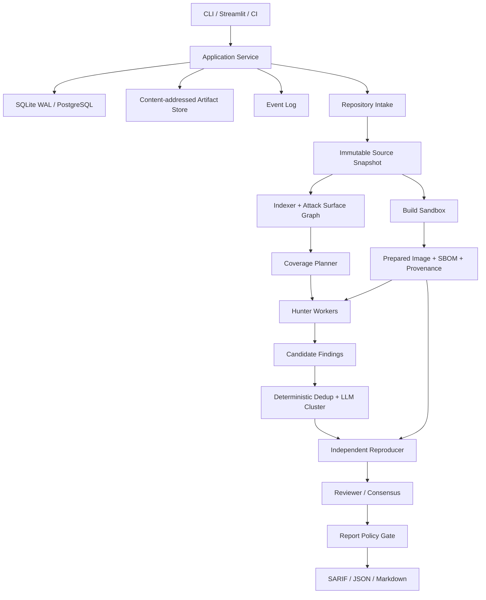

# VulnHunt Agent V2 고도화 설계

상태: Draft for implementation  
기준 코드: `ksgsslee/vulnhunt-agent` `f75ceed`  
목표: 검증 가능한 취약점만 보고하고, 신뢰할 수 없는 저장소와 PoC를 안전하게 실행하며, 언어·모델·실행 환경을 확장할 수 있는 로컬 우선 취약점 분석 플랫폼

## 1. 결론

V2는 기존의 `Filter → Rank → Hunter → Cluster → Reviewer` 골격을 유지하되, 다음 세 가지를 구조적으로 바꾼다.

1. **프롬프트가 아니라 상태 머신이 증거 수준을 강제한다.**
   LLM이 `confirmed`라고 출력했다는 이유로 보고하지 않는다. 별도의 Reproducer가 깨끗한 샌드박스에서 PoC를 다시 실행하고, 기계 판독 가능한 성공 조건을 만족한 경우에만 `reproduced` 상태로 승격한다.
2. **분석 제어면과 실행 데이터면을 분리한다.**
   오케스트레이터·DB·UI는 host/control plane에 두고, repository build와 PoC 실행은 자격증명과 host bind mount가 없는 disposable sandbox에서 수행한다.
3. **파일 단위 스캔을 attack-surface slice 단위 분석으로 확장한다.**
   파일은 coverage와 병렬화의 기본 단위로 남기되, route/CLI/parser/deserializer 같은 entrypoint와 sink 사이의 관련 파일 집합을 분석 단위로 만든다.

V2의 최종 보안 보증은 다음 문장으로 정의한다.

> Final Report에는 독립 Reproducer가 immutable source snapshot에서 재현하고, Reviewer가 코드 경로와 공격 전제조건을 확인했으며, Report Policy가 필요한 증거 artifact를 검증한 finding만 포함한다.

## 2. 현재 구현에서 유지할 것

현재 코드의 다음 선택은 단순하고 효과적이므로 유지한다.

- Ranker, Hunter, Reviewer 모델을 독립적으로 선택하는 구조
- 파일·Hunter별 fresh context
- `read_file`, `grep`, `list_dir` 중심의 작은 코드 탐색 도구 집합
- 언어별 Markdown prompt 플러그인
- Docker 기반 실제 PoC 실행
- JSONL event trace와 per-task artifact
- Tree-sitter 기반 저비용 repository index
- CVSS vector는 LLM이 선택하고 점수는 결정론적 코드로 계산하는 방식
- Streamlit을 로컬 운영 UI로 사용하는 방식

## 3. 해결해야 할 현재 결함

### 3.1 검증 보증이 프롬프트에만 존재한다

- Hunter가 실제로 `exec`를 호출했는지와 finding의 `status=confirmed`가 연결되어 있지 않다.
- Reviewer는 PoC 실행 권한이 없으므로 README의 “PoC 재실행”을 구현하지 않는다.
- Reviewer는 `unverified` finding도 코드상 reachable하다는 이유로 `real`로 올릴 수 있다.
- 최종 보고서 생성기가 reproduction artifact 존재 여부를 강제하지 않는다.

### 3.2 Sandbox 경계가 충분히 강하지 않다

- 준비 단계가 네트워크 연결과 `/code` RW mount를 가진 상태로 대상 프로젝트의 build script를 실행한다.
- 컨테이너는 기본적으로 root이며 `cap-drop`, `no-new-privileges`, read-only root, PID 제한이 없다.
- host repository를 직접 mount하므로 악의적인 build가 host working tree를 변경할 수 있다.
- build와 exploit이 같은 이미지 계보를 공유하지만 provenance와 정책이 명시되지 않는다.

### 3.3 분석 coverage가 Ranker 한 번에 과도하게 의존한다

- 파일명, import, symbol만 본 1~5점 평가에서 기본값 5점 파일만 선택한다.
- test/example/migration을 일괄 제외하여 실제 배포 경로를 놓칠 수 있다.
- route, middleware, caller, sink의 관계 그래프가 없다.
- 현재 `arch` 정보는 언어와 runtime뿐이다.

### 3.4 에이전트와 결과 계약이 약하다

- LLM JSON을 정규식으로 추출할 뿐 schema validation이 없다.
- tool call과 finding evidence가 연결되지 않는다.
- 동일 세션에서 성공·실패 PoC를 여러 번 실행해도 어떤 실행이 최종 근거인지 불명확하다.
- Clusterer는 서로 다른 Hunter가 둘 이상 결과를 냈을 때만 동작한다.
- 리뷰 재시작은 group 단위로 완전하게 resume되지 않는다.

### 3.5 언어 지원과 운영 인터페이스가 미완성이다

- 기본 배포는 Python prompt와 Python environment만 완성되어 있다.
- Java/Node 인덱서와 sandbox 골격은 있지만 end-to-end contract test가 없다.
- CLI/API가 없어 자동화와 CI 연동이 어렵다.
- JSON 파일을 여러 coroutine이 갱신하므로 규모가 커질수록 원자성·동시성 문제가 생긴다.

## 4. V2 목표와 비목표

### 목표

- 최종 finding마다 재현 가능한 evidence bundle 제공
- 신뢰할 수 없는 repository build와 PoC 실행의 강한 격리
- Python을 우선 완성하고 Java/Node를 contract 기반으로 추가
- 로컬 단일 머신에서 시작하되 worker 분리가 가능한 구조
- 중단 후 task 단위 정확한 resume
- 고정 corpus에서 precision, recall, reproduction rate를 측정
- 모델 교체 시 결과 품질과 비용을 비교 가능하게 기록
- CLI, UI, CI가 동일한 application service를 사용

### 비목표

- V2 초기 단계에서 완전한 범용 SAST/taint engine 구현
- 인터넷 전체를 대상으로 한 능동 스캐닝
- production target에 대한 자동 공격
- LLM 판단만으로 자동 CVE 제출 또는 외부 공개
- 첫 릴리스부터 Kubernetes 분산 실행

## 5. 위협 모델

V2는 다음 입력을 모두 잠재적으로 악성으로 취급한다.

- clone 대상 Git repository 및 submodule
- package metadata와 build script
- source file 내용과 prompt injection 문자열
- Hunter가 생성한 shell command와 PoC
- dependency install 결과
- LLM provider 응답과 tool arguments

보호 대상은 다음과 같다.

- host filesystem과 Docker socket
- AWS/OpenAI/Git 자격증명
- 다른 run의 source와 artifact
- host network와 내부 서비스
- 오케스트레이터 프로세스 및 상태 DB
- 보고서의 무결성과 evidence provenance

## 6. 목표 아키텍처



### Control plane

- Application Service
- task scheduler/state machine
- model gateway
- policy engine
- metadata DB
- artifact index
- UI/CLI

Control plane에는 대상 코드 실행 기능을 두지 않는다.

### Execution plane

- repository intake worker
- build sandbox
- Hunter sandbox
- Reproducer sandbox

각 worker는 opaque job spec과 content hash로 식별한 artifact만 입력받는다. Docker socket과 cloud credentials를 sandbox 안에 전달하지 않는다.

## 7. 핵심 상태 모델

### 7.1 Run 상태

```text
created
  → snapshotting
  → indexing
  → planning
  → building
  → hunting
  → reproducing
  → reviewing
  → reporting
  → completed | failed | cancelled
```

모든 transition은 DB transaction 안에서 수행하고, `(run_id, task_type, task_key, attempt)`를 idempotency key로 사용한다.

### 7.2 Finding 상태

```text
hypothesis
  → statically_supported
  → poc_ready
  → reproduction_pending
  → reproduced
  → reviewer_verified
  → reportable

어느 단계에서든:
  → rejected
  → unclear
  → environment_blocked
  → policy_blocked
```

허용되지 않는 전이를 코드로 막는다. 예를 들어 `poc_ready → reportable` 직접 전이는 불가능해야 한다.

### 7.3 최종 보고 조건

기본 `strict` policy에서 다음 조건을 모두 만족해야 한다.

- `finding.state == reviewer_verified`
- 독립 Reproducer 실행이 존재
- 실행한 source snapshot hash가 run의 snapshot hash와 동일
- 실행 command, exit code, stdout/stderr hash가 존재
- success oracle이 `passed`
- Reviewer verdict가 `real`
- CVSS vector schema가 유효
- required preconditions가 구조화되어 있음
- evidence의 file path와 line range가 snapshot에 존재

`audit` policy에서는 미재현 finding을 별도 “Needs manual review” 섹션에 포함할 수 있지만 confirmed finding과 섞지 않는다.

## 8. Evidence Ledger

모든 중요한 주장에 evidence ID를 부여한다.

```json
{
  "evidence_id": "ev_01J...",
  "kind": "sandbox_execution",
  "producer": "reproducer",
  "source_snapshot": "sha256:...",
  "image_digest": "sha256:...",
  "command": ["python", "/workspace/poc.py"],
  "exit_code": 0,
  "stdout_artifact": "sha256:...",
  "stderr_artifact": "sha256:...",
  "started_at": "...",
  "duration_ms": 324,
  "oracle": {
    "type": "regex",
    "expression": "LEAKED_SECRET=",
    "result": "passed"
  }
}
```

Finding은 문자열 형태의 `exec_output` 대신 `evidence_ids`를 참조한다. 보고서는 ledger에서 검증된 evidence만 렌더링한다.

## 9. Repository Intake와 Source Snapshot

### Intake 절차

1. URL과 ref를 정규화한다.
2. clone은 별도 intake sandbox에서 수행한다.
3. commit SHA를 고정하고 shallow 여부와 무관하게 manifest를 만든다.
4. symlink, submodule, Git LFS pointer를 정책에 따라 처리한다.
5. `.git`을 제외한 source tar를 생성하고 SHA-256을 계산한다.
6. 이후 단계는 host working tree가 아니라 immutable tar snapshot을 사용한다.

### 필수 manifest

- source URL
- requested ref / resolved commit SHA
- file path, mode, size, SHA-256
- submodule commit
- detected languages
- package manager metadata
- ingest policy version

기존처럼 repository name만으로 clone 디렉터리를 재사용하지 않는다. `(normalized_url, commit_sha)`를 cache key로 사용한다.

## 10. Build Sandbox 고도화

### 격리 원칙

- host bind RW mount 금지
- source snapshot을 sandbox-local volume에 extract
- rootless runtime 우선
- `--cap-drop=ALL`
- `--security-opt=no-new-privileges`
- read-only root filesystem
- writable directory는 `/tmp`, `/workspace`, package cache로 제한
- non-root UID/GID
- PID, CPU, memory, disk, wall-clock 제한
- Docker socket, SSH agent, cloud metadata 접근 금지
- 가능하면 gVisor, Kata 또는 Firecracker backend 제공

### 네트워크 정책

`offline`, `package-registry-only`, `custom-egress` 세 모드를 제공한다.

- 기본값은 registry allowlist만 허용한다.
- DNS와 HTTP 로그를 artifact로 남긴다.
- dependency install이 끝나면 prepared image에서 credentials와 package token을 제거한다.
- Hunter와 Reproducer는 항상 `network=none`을 기본으로 한다.

### Build 결과

- immutable image digest
- build log
- install command list
- environment manifest
- SBOM(CycloneDX 또는 SPDX)
- source snapshot hash
- sandbox policy version

## 11. Indexer와 Attack Surface Graph

V2 index는 단순 symbol 목록을 넘어 다음 node와 edge를 만든다.

### Node

- file, module, class, function, method
- HTTP route, RPC handler, CLI command
- serializer/deserializer
- auth/authz middleware
- template/rendering boundary
- SQL/command/file/network sink
- configuration flag

### Edge

- imports
- calls / possible-calls
- route-to-handler
- middleware-wraps-handler
- reads-parameter
- writes-to-sink
- sanitizes
- permission-checks

완전한 정적 call graph가 아니어도 된다. Tree-sitter query와 언어별 heuristic으로 confidence가 붙은 graph를 만든다.

```json
{
  "from": "python:function:app.routes.fetch",
  "to": "python:call:httpx.get",
  "kind": "calls",
  "confidence": 0.91,
  "location": {"path": "app/routes.py", "line": 81}
}
```

## 12. Coverage Planner와 Ranker

LLM rank 하나가 coverage를 결정하지 않도록 세 신호를 합친다.

```text
priority = static_risk + graph_centrality + llm_score + coverage_bonus
```

### Static risk

- 위험 API와 framework route
- auth/authz/crypto 관련 symbol
- parser와 dynamic execution
- 최근 변경 파일 또는 선택한 diff

### Graph signal

- entrypoint에서 sink까지의 거리
- 호출자 수
- trust boundary 통과 여부

### LLM score

- 현재 1~5 점수를 유지하되 reasoning code를 구조화
- 파일이 누락되거나 중복되면 schema validator가 재요청

### Coverage policy

- 모든 entrypoint는 최소 한 번 분석
- 모든 critical sink는 최소 한 번 backward slice 분석
- score 4 이상 파일은 예산 내 포함
- score 1~3 파일도 deterministic sample 포함
- 제외된 파일과 이유를 coverage report에 기록

## 13. Hunter Portfolio

단일 “broad Python” Hunter 대신 언어별 portfolio를 둔다.

### 공통 Hunter

- `entrypoint-dataflow`: 외부 입력부터 sink까지 추적
- `authz-boundary`: 객체 수준·기능 수준 권한 검사
- `injection`: SQL, command, template, expression injection
- `ssrf-network`: URL parser, redirect, DNS/IP validation
- `filesystem`: traversal, archive extraction, symlink
- `deserialization-parser`: unsafe deserialize, parser differential
- `secrets-crypto`: token validation, nonce, key handling
- `business-logic`: state transition, replay, race, quota

### 언어별 추가 Hunter

- Python: pickle/yaml, Django/FastAPI/Flask, Jinja, subprocess
- Java: servlet/filter, Jackson/XStream, SpEL, JNDI, path normalization
- Node: Express/Nest middleware, prototype pollution, child_process, URL parsing

### 분석 단위

`starting_file` 대신 다음 `AnalysisSlice`를 전달한다.

```json
{
  "slice_id": "slice_...",
  "entrypoints": ["app/routes.py:fetch_url"],
  "suspected_sinks": ["httpx.get"],
  "seed_files": ["app/routes.py", "app/security/url.py"],
  "graph_paths": [["fetch_url", "normalize", "httpx.get"]],
  "coverage_reason": "network entrypoint reaches dynamic outbound request"
}
```

Hunter는 seed file 바깥을 탐색할 수 있지만 tool budget과 탐색 이유를 기록해야 한다.

## 14. Tool API V2

### 읽기 도구

- `read_file(snapshot_id, path, start, end)`
- `search_code(snapshot_id, query, mode, path_filter)`
- `list_tree(snapshot_id, path, depth)`
- `get_symbol(symbol_id)`
- `get_callers(symbol_id)`
- `get_callees(symbol_id)`
- `get_slice(slice_id)`

### PoC 도구

- `write_workspace_file(path, content)`
- `run_command(argv, cwd, env_allowlist, timeout, oracle)`
- `read_execution(execution_id)`
- `submit_candidate(candidate_schema)`

shell string 대신 기본적으로 argv 배열을 사용한다. shell이 꼭 필요한 경우 별도 `run_shell` capability와 정책 승인을 요구한다.

### Tool result 규칙

- 모든 결과에 `tool_call_id`, byte count, truncation 여부 포함
- source read에는 snapshot hash 포함
- execution에는 image digest와 evidence ID 포함
- 동일 요청 dedup은 content hash 기반
- path 검사는 `Path.is_relative_to()`를 사용

## 15. Candidate Finding Schema

Pydantic v2 또는 JSON Schema로 다음 계약을 강제한다.

```python
class CandidateFinding(BaseModel):
    candidate_id: str
    title: str
    weakness: str
    entrypoint: CodeLocation
    sink: CodeLocation | None
    dataflow: list[CodeLocation]
    preconditions: list[Precondition]
    attacker_capability: str
    impact: list[str]
    evidence_ids: list[str]
    poc: PocSpec | None
    confidence: float
```

모델 출력은 provider가 지원하면 native structured output을 사용한다. 미지원 provider는 JSON Schema validation 실패 시 제한된 횟수만 repair한다.

## 16. Independent Reproducer

Reproducer는 Hunter 세션과 컨테이너를 공유하지 않는다.

### 입력

- immutable source snapshot
- prepared image digest
- Hunter의 PoC artifact
- argv/cwd/env spec
- success oracle
- 필요한 fixture
- preconditions

### 절차

1. 깨끗한 sandbox를 생성한다.
2. PoC와 fixture만 주입한다.
3. 같은 명령을 기본 2회 실행한다.
4. 두 번 모두 oracle이 성공해야 deterministic reproduction으로 인정한다.
5. timeout, crash, flaky 결과를 구분한다.
6. 가능한 경우 negative control을 실행한다.

### Oracle 예시

- exit code
- stdout/stderr regex
- 생성된 파일의 hash/content
- HTTP response status/body
- 예상 exception type
- process crash/signal
- resource threshold

LLM이 출력 문자열을 보고 “성공 같다”고 판정하는 것을 기본 oracle로 사용하지 않는다. LLM oracle은 보조 판정으로만 허용한다.

### Negative control

가능한 순서대로 다음 중 하나를 사용한다.

- 공격 payload를 안전한 payload로 바꿨을 때 실패
- sanitizer를 통과하지 않는 대조 입력
- fixed commit 또는 patch 적용 후 실패
- 취약 옵션을 끈 상태에서 실패

## 17. Dedup, Reviewer, Consensus

### Dedup

먼저 결정론적 key를 계산한다.

```text
weakness + normalized_sink + root_cause_location + entrypoint_family
```

그 다음 애매한 후보만 LLM Clusterer가 병합한다. Clusterer는 title뿐 아니라 evidence 요약과 dataflow hash를 본다.

### Reviewer

Reviewer는 다음 artifact를 받는다.

- candidate schema
- source evidence
- reproduction evidence
- negative control
- graph slice
- framework/deployment preconditions

Reviewer는 임의 명령을 직접 실행하지 않고 `request_reproduction_variant`를 통해 Reproducer에 추가 실험을 요청한다. 이로써 판단과 실행 권한을 분리한다.

### Consensus

기본 정책:

- reproduced + 명확한 root cause: Reviewer 1명
- high/critical 또는 경계가 애매한 finding: 서로 다른 모델/프롬프트 Reviewer 2명
- verdict 불일치: Arbiter 또는 human review

Consensus는 비용 정책으로 조정 가능하게 한다.

## 18. CVSS와 보고서

- CVSS 3.1과 4.0을 모두 지원하되 첫 구현은 3.1 유지
- vector schema validation과 공식 score 계산을 코드로 수행
- CWE는 허용 목록과 weakness mapping을 사용
- non-default option, auth requirement, deployment topology를 구조화된 precondition으로 저장

출력 형식:

- canonical JSON
- Markdown
- SARIF 2.1.0
- CycloneDX VEX 선택 지원

보고서에는 반드시 다음 provenance를 포함한다.

- repository URL과 commit SHA
- source snapshot hash
- sandbox image digest
- reproduction command와 oracle
- affected location과 data flow
- preconditions
- Reviewer/Policy 버전
- redacted execution excerpt

## 19. 저장소와 큐

### 로컬 우선 구현

- SQLite WAL: run, task, finding, transition, model usage metadata
- filesystem object store: source snapshot, logs, PoC, reports
- object filename: SHA-256
- JSONL event export: 디버깅과 UI streaming

### 주요 테이블

```text
runs
tasks
task_attempts
analysis_slices
candidate_findings
finding_transitions
evidence
artifacts
model_calls
sandbox_executions
reviews
reports
```

worker는 lease와 heartbeat를 사용한다. 실패한 worker의 lease가 만료되면 idempotency key를 유지한 채 재시도한다.

## 20. Model Gateway

현재 provider abstraction을 확장해 다음 기능을 공통 적용한다.

- async request API
- provider별 rate limiter
- exponential backoff와 retry classification
- max cost / max token / max wall-clock budget
- structured output capability detection
- prompt/tool schema version 기록
- optional response cache
- secret redaction
- refusal와 content-filter를 명확한 task 상태로 변환

모든 model call에는 다음 metadata를 저장한다.

```text
run_id, task_id, role, model_id, provider,
prompt_version, tool_schema_version,
input/output/cache tokens, latency, retry count, cost
```

## 21. UI와 CLI

Application Service를 먼저 만들고 UI와 CLI가 이를 공유하게 한다.

### CLI 예시

```bash
vulnhunt scan ./repo --profile python-strict
vulnhunt scan https://github.com/org/repo --ref abc123
vulnhunt status <run-id>
vulnhunt findings <run-id> --state reportable
vulnhunt reproduce <finding-id>
vulnhunt export <run-id> --format sarif
```

### UI 필수 화면

- source snapshot과 build provenance
- coverage map과 제외 이유
- task DAG 및 재시도
- Hunter tool trace
- candidate → reproduction → review 상태 전이
- PoC 실행 결과와 negative control 비교
- 모델별 비용·속도·승인율
- finding 승인/보류/기각 human action

## 22. 제안 패키지 구조

```text
src/vulnhunt_agent/
  domain/
    models.py
    states.py
    policies.py
    schemas.py
  application/
    services.py
    commands.py
    queries.py
  orchestration/
    scheduler.py
    state_machine.py
    leases.py
  intake/
    git.py
    snapshot.py
    manifest.py
  analysis/
    indexer/
    graph/
    planner/
    heuristics/
  agents/
    hunter.py
    clusterer.py
    reviewer.py
    arbiter.py
    prompts/
  tools/
    code.py
    graph.py
    workspace.py
    execution.py
  reproduction/
    service.py
    oracles.py
    controls.py
  sandbox/
    backend.py
    docker_rootless.py
    policies.py
    provenance.py
  infrastructure/
    db/
    artifacts/
    events/
    llm/
  reporting/
    json.py
    markdown.py
    sarif.py
  interfaces/
    cli/
    streamlit/
```

## 23. 테스트 전략

### Unit test

- 상태 전이와 policy gate
- JSON Schema/Pydantic validation
- path normalization
- CVSS 계산
- oracle 판정
- dedup key
- prompt loader와 provider conversion

### Contract test

- 각 LLM provider의 text/tool/structured output 변환
- Python/Java/Node environment adapter
- Docker backend의 resource/network policy
- artifact store hash와 immutability

### Integration fixture

작고 결정론적인 vulnerable/fixed pair를 repository로 관리한다.

- Python Flask SSRF allowlist bypass
- Django object-level auth bypass
- Python archive path traversal
- unsafe YAML/pickle
- Node command injection
- Java path normalization 또는 deserialization
- false-positive fixture: upstream validation이 공격을 차단

각 fixture에는 다음 ground truth가 있어야 한다.

- vulnerable commit
- fixed commit
- expected CWE
- expected entry/sink
- canonical PoC
- success oracle
- expected negative control

### 품질 지표

- candidate recall
- final report precision
- reproduction success rate
- flaky reproduction rate
- time-to-first-finding
- cost per reportable finding
- code coverage by entrypoint/sink
- model별 false-positive rate

### Sandbox security test

- host path 변경 시도
- Docker socket 접근
- metadata endpoint 접근
- fork bomb
- disk exhaustion
- symlink escape
- package install credential exfiltration
- 다른 run artifact 읽기

## 24. 구현 로드맵

### Phase 0 — Baseline 고정

기간 예상: 3~5일

- 현재 main을 baseline tag로 고정
- 기존 pipeline smoke test 작성
- current JSON artifact를 fixture로 저장
- README와 실제 동작 차이 문서화
- ruff, mypy, pytest, pre-commit 도입

완료 기준:

- 작은 Python fixture에 대해 기존 pipeline이 CI에서 실행됨
- current behavior를 재현하는 golden artifact가 존재

### Phase 1 — Domain schema와 상태 저장

기간 예상: 1~2주

- Pydantic domain model
- finding/run 상태 머신
- SQLite WAL repository
- content-addressed artifact store
- JSONL event adapter
- 기존 RunStore에서 migration/import
- CLI read-only commands

완료 기준:

- 잘못된 finding schema가 저장되지 않음
- 불법 상태 전이가 unit test에서 모두 거부됨
- 동일 task 재실행이 중복 finding을 만들지 않음

### Phase 2 — Sandbox V2와 Reproducer

기간 예상: 2주

- immutable snapshot
- build/hunt/reproduce sandbox 분리
- rootless 또는 hardened Docker profile
- argv execution API
- execution evidence ledger
- oracle와 2회 재현
- strict report policy gate

완료 기준:

- Reproducer evidence 없는 finding은 final report에 절대 포함되지 않음
- sandbox escape test corpus가 통과
- 같은 PoC를 두 번 실행해 동일 oracle 결과를 얻음

### Phase 3 — Analysis Graph와 Hunter Portfolio

기간 예상: 2~3주

- framework route와 sink detector
- heuristic call/dataflow graph
- AnalysisSlice/Coverage Planner
- Python Hunter portfolio 6개 이상
- deterministic + LLM dedup
- coverage report

완료 기준:

- 모든 detected entrypoint와 critical sink가 최소 한 slice에 포함
- 기준 corpus에서 기존 버전보다 recall이 증가
- score 5 threshold에 의한 단일 실패 지점 제거

### Phase 4 — Reviewer, Consensus, Reporting

기간 예상: 1~2주

- evidence-aware Reviewer
- reproduction variant request
- high/critical dual review
- CVSS/CWE validation
- Markdown/JSON/SARIF exporter
- Streamlit 상태 전이 UI

완료 기준:

- report의 모든 claim이 evidence ID로 역추적 가능
- Reviewer 불일치가 자동으로 확정되지 않음
- SARIF schema validation 통과

### Phase 5 — Multi-language와 운영 강화

기간 예상: 언어당 1~2주

- Node adapter와 corpus
- Java adapter와 corpus
- provider rate/cost policy
- worker lease/heartbeat
- CI mode와 diff scan
- optional PostgreSQL/remote object store

완료 기준:

- 언어별 contract/integration corpus 통과
- 중단 후 정확한 resume
- model/provider 교체 benchmark 제공

## 25. 첫 구현 백로그

우선순위 순서:

1. pytest 기반 baseline fixture와 CI
2. Pydantic `CandidateFinding`, `Evidence`, `ReviewVerdict`
3. finding state machine과 strict report policy
4. SQLite WAL + artifact hash store
5. source snapshot tar/manifest
6. hardened Docker command builder
7. independent Reproducer와 regex/file/exit-code oracle
8. Hunter tool 결과에 evidence ID 연결
9. Reviewer 입력을 reproduction evidence 기반으로 변경
10. CLI `scan/status/reproduce/export`
11. Python route/sink detector와 AnalysisSlice
12. Python Hunter portfolio
13. SARIF exporter
14. benchmark dashboard

첫 milestone은 UI 개선이 아니라 **“검증되지 않은 finding은 구조적으로 보고할 수 없음”**이어야 한다.

## 26. 주요 설계 결정

### ADR-001: 범용 agent framework를 당장 도입하지 않는다

현재 hand-written loop는 작고 관찰 가능하다. 상태 머신과 evidence contract가 안정되기 전 LangGraph 같은 framework를 도입하면 핵심 문제를 숨길 수 있다. 향후 scheduler가 복잡해질 때 orchestration adapter로 검토한다.

### ADR-002: 로컬 V2는 SQLite + filesystem으로 시작한다

현재 JSON 구조보다 원자성과 query가 좋고 설치 부담이 작다. domain repository interface를 두어 PostgreSQL로 교체 가능하게 한다.

### ADR-003: Reviewer와 Reproducer를 분리한다

Reviewer는 판단하고 Reproducer는 실행한다. arbitrary command 권한을 판단 agent에 직접 주지 않아 auditability와 재현성을 높인다.

### ADR-004: 최종 보고 조건은 code policy다

프롬프트는 행동을 유도하지만 보안 보증을 만들지 못한다. 증거 existence, hash, oracle, 상태 전이를 Python policy에서 검증한다.

### ADR-005: Python을 먼저 완성한다

불완전한 다중 언어 표시보다 한 언어에서 end-to-end 검증과 benchmark를 완성한 뒤 adapter contract로 확장한다.

## 27. 라이선스와 fork 운영

원본은 Apache-2.0이므로 수정·재배포가 가능하다. 다음을 유지한다.

- 원본 `LICENSE`
- 기존 copyright/attribution
- 수정한 파일과 주요 변경사항 기록
- upstream commit 기준 명시

Git remote는 다음 구조를 권장한다.

```text
upstream  https://github.com/ksgsslee/vulnhunt-agent.git
origin    <새로 만들 사용자 저장소 URL>
```

현재 로컬 복사본은 원본 remote를 `upstream`으로 이름 변경해 두었다. 새 저장소가 생기면 `origin`만 추가한다.

## 28. 구현 착수 시 첫 PR 범위

첫 PR은 기능 확장보다 baseline과 contract를 만든다.

- `docs/architecture-v2.md`
- `tests/fixtures/python/`에 vulnerable/fixed 최소 repository
- `domain/schemas.py`에 Pydantic model
- `domain/states.py`에 finding transition
- `reporting/policy.py`에 strict gate
- 기존 Hunter 결과를 새 CandidateFinding으로 변환하는 compatibility adapter
- CI에서 unit test와 fixture smoke test 실행

첫 PR acceptance criteria:

1. `confirmed` 문자열만으로 reportable finding을 만들 수 없다.
2. reproduction evidence가 없는 fixture는 policy gate에서 실패한다.
3. 기존 결과 파일은 compatibility adapter를 통해 읽을 수 있다.
4. 원본 scanner의 기본 Python run이 깨지지 않는다.

이후 두 번째 PR에서 Sandbox V2와 Reproducer를 연결한다.
